# Advanced Server & Network Analysis Assistant 🌐

[**🇹🇷 Türkçe**](#proje-özeti) | [**🇬🇧 English**](#english-project-summary)

---

## Proje Özeti
Hosting destek uzmanları, sistem yöneticileri ve web geliştiricileri için tasarlanmış; **DNS, SSL, Whois ve sunucu altyapı analizlerini** tek bir panelde birleştiren kapsamlı bir Chrome eklentisidir. Operasyonel süreçlerdeki insan hatasını minimize etmek ve müşteri destek yanıt sürelerini kısaltmak amacıyla geliştirilmiştir.

🔗 **İndirme Linki:** [Google Web Store](https://go.emrecb.com/dns-whois-ssl-hosting-sorgu-web-store)

### 🚀 Öne Çıkan Özellikler ve Teknik Yetenekler

#### 🔍 Akıllı DNS Analizi ve Veri Vurgulama (Highlighting)
* **Kapsamlı Tarama:** A, MX, NS, TXT (SPF/DKIM), CNAME, AAAA ve SOA dahil tüm kayıtları tarar.
* **Özel Vurgulama Algoritması:** Teknik ekiplerin, önceden tanımladıkları IP veya NS adreslerini (kendi firma verilerini) DNS sonuçları arasında otomatik olarak renkli vurgulamasını sağlar. Bu özellik, hatalı yönlendirmelerin saniyeler içinde fark edilmesini sağlar.
* **Ek Subdomain Tarama:** Standart alt alan adlarına ek olarak, kullanıcı tarafından belirlenen özel subdomainleri de sorguya dahil eder.

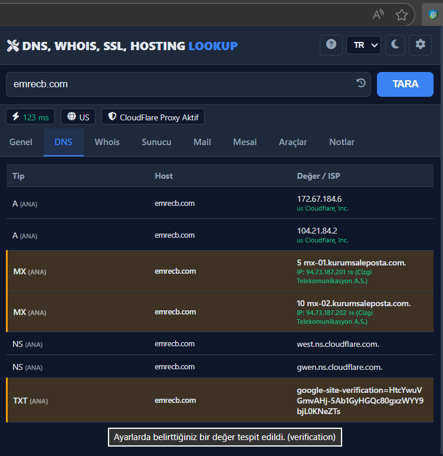
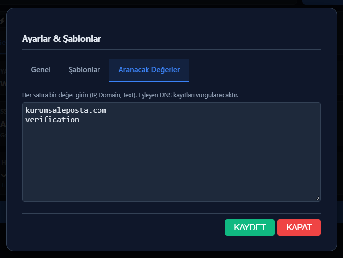

#### 🔒 Gelişmiş SSL ve Sunucu Tanılama
* **Canlı Kontrol (Live Check):** Sadece veritabanı kayıtlarına güvenmez; anlık SSL geçerliliği, bitiş süresi, sağlayıcı (Issuer) firma ve HTTPS yönlendirme durumunu analiz eder.
* **Altyapı Tespiti:** HTTP Header analizi ile sunucu panelini (cPanel, Plesk vb.) ve CMS altyapısını tespit eder.

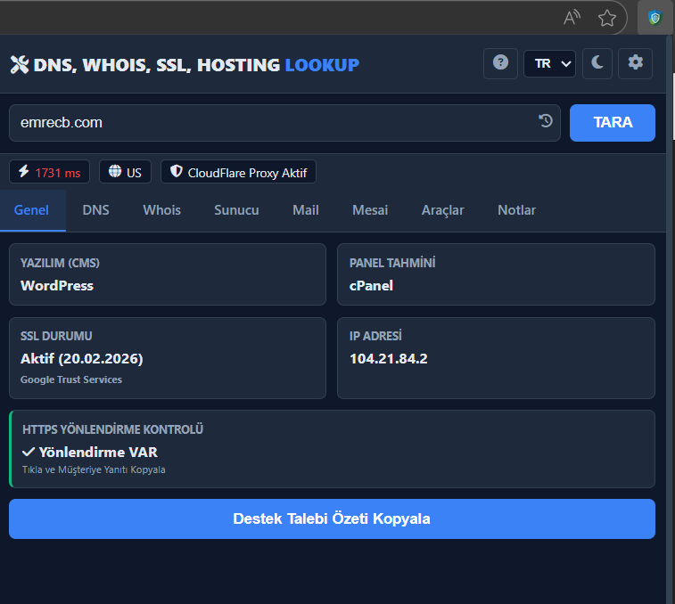
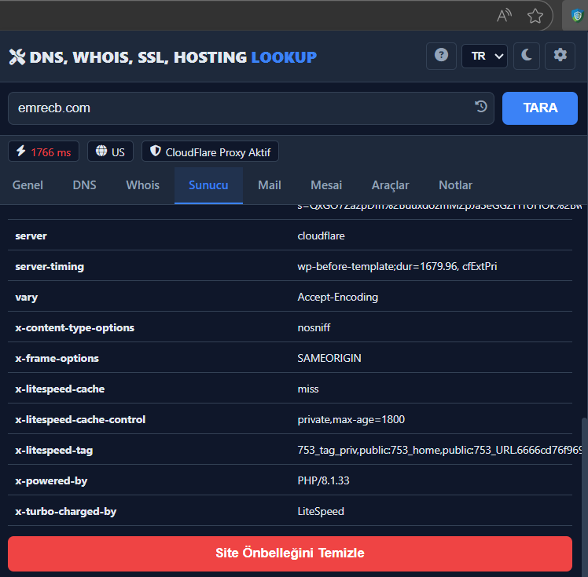

#### ⚡ Operasyonel Verimlilik (Smart Copy & Context Menu)
* **Tıkla ve Yanıtla:** Eklentideki herhangi bir veriye (IP, SSL tarihi, DNS kaydı) tıklandığında, sonucu müşteriye gönderilmeye hazır, profesyonel bir destek mesajı formatında panoya kopyalar.
* **Hızlı Tarama:** Sayfa içerisinde seçilen herhangi bir alan adına sağ tıklayarak doğrudan analiz başlatma imkanı sunar.

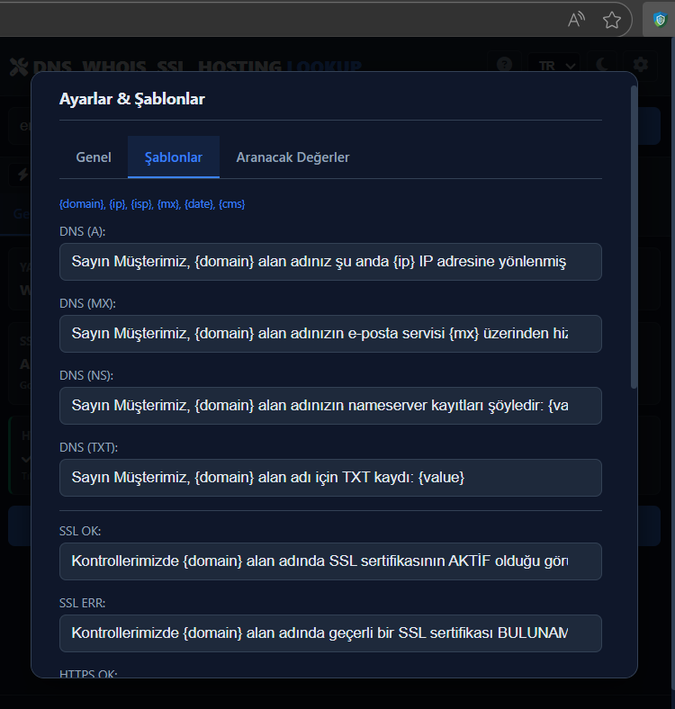
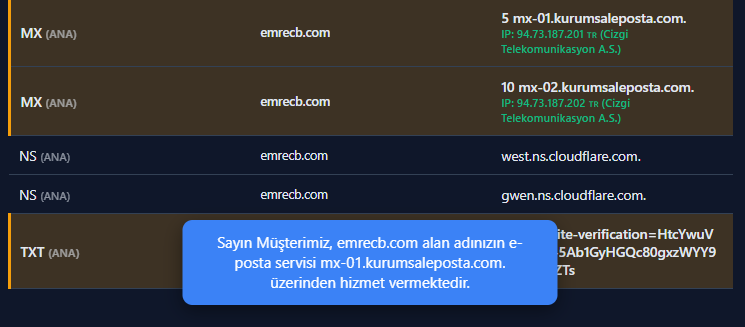
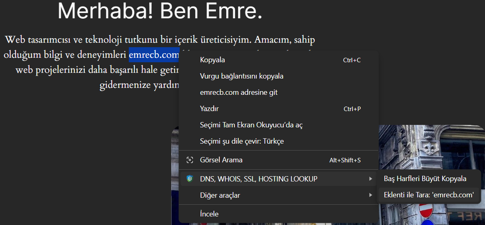

#### 🛠 Kapsamlı Araç Seti
* Detaylı Whois sorgusu ve analizi.
* Vardiya takibi, mola sayaçları ve sık kullanılan Linux/MySQL komutlarını içeren notlar bölümü.

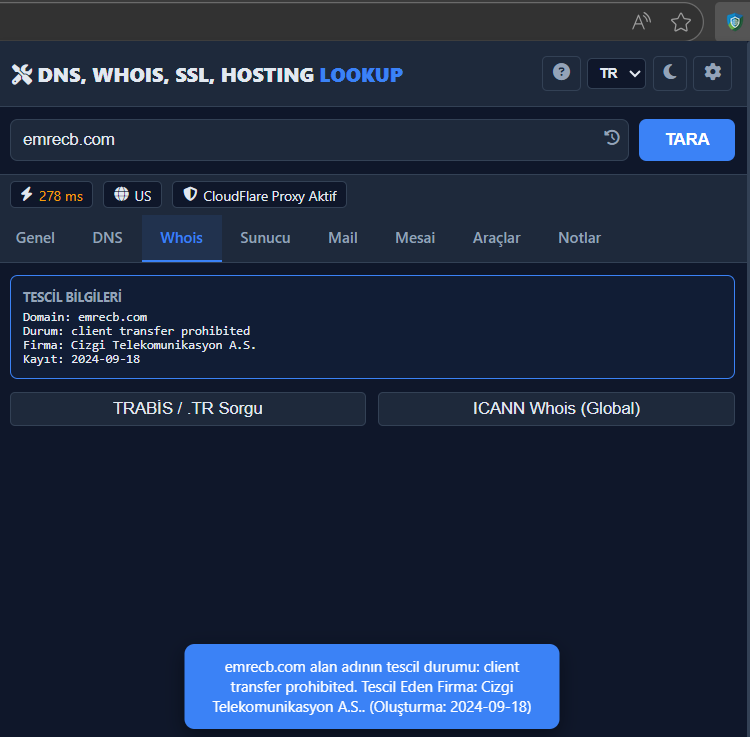
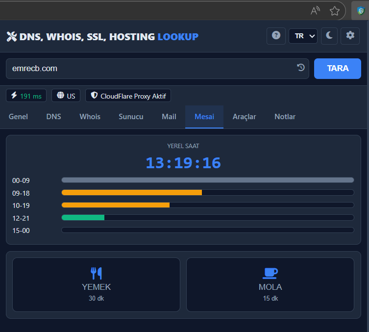
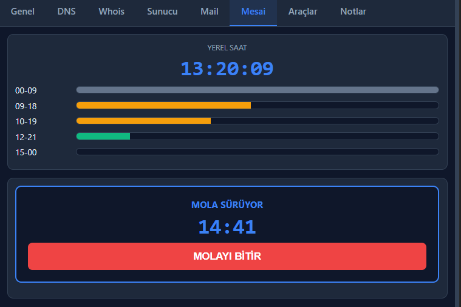
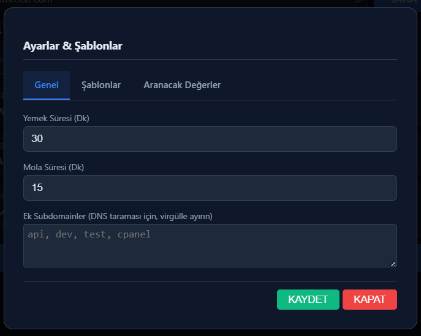

#### 🌍 Çok Dilli ve Genişletilebilir Yapı
* Tamamen çok dilli (Türkçe/İngilizce) altyapı.
* Kişiselleştirilebilir ayarlar ve veri saklama (Local Storage) yönetimi.

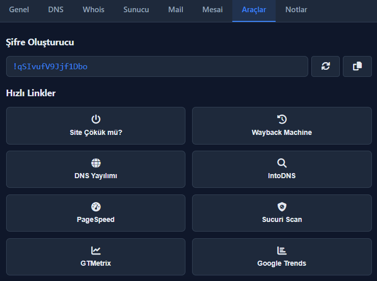
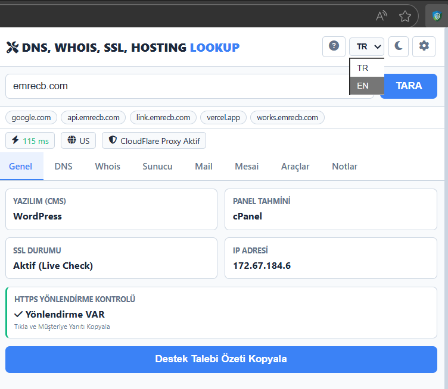

### 💻 Kullanılan Teknolojiler
* JavaScript (ES6+)
* Chrome Extension API (Manifest V3)
* REST API Entegrasyonları (Google DNS, RDAP, IPWhois)
* Asenkron Veri İşleme

---

## English Project Summary
A comprehensive Chrome extension designed for **Hosting Support Agents, System Administrators, and Web Developers**. It unifies DNS, SSL, Whois, and server infrastructure analysis into a single, efficient dashboard. This tool is engineered to minimize human error in operational workflows and significantly reduce customer support response times.

🔗 **Download Link:** [Google Web Store](https://go.emrecb.com/dns-whois-ssl-hosting-lookup-web-store)

### 🚀 Key Features & Technical Capabilities

#### 🔍 Intelligent DNS Analysis & Data Highlighting
* **Full Record Scan:** Scans all major records including A, MX, NS, TXT (SPF/DKIM), CNAME, AAAA, and SOA.
* **Custom Watchlist Highlighting:** Features a custom algorithm that automatically highlights pre-defined IPs or NS records (company assets) within DNS results. This allows technical teams to spot misconfigurations or correct pointers instantly.
* **Extended Subdomain Scanning:** Automatically checks standard subdomains and allows users to define custom subdomains for deeper analysis.

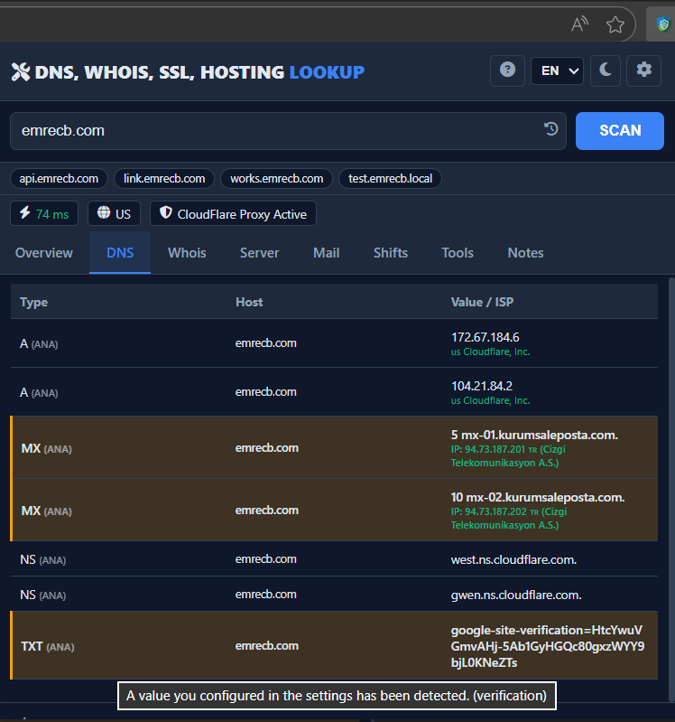

#### 🔒 Advanced SSL & Server Diagnostics
* **Live Connection Check:** Goes beyond cached databases by verifying real-time SSL validity, expiration date, Issuer details, and HTTP-to-HTTPS redirection status.
* **Infrastructure Detection:** Detects Server Control Panels (cPanel, Plesk, etc.) and CMS platforms via HTTP Header and DOM analysis.

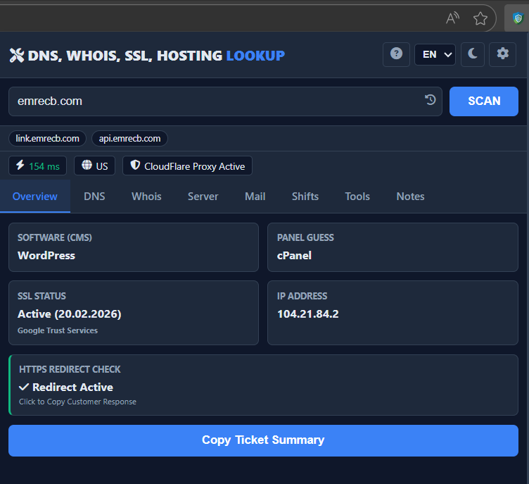
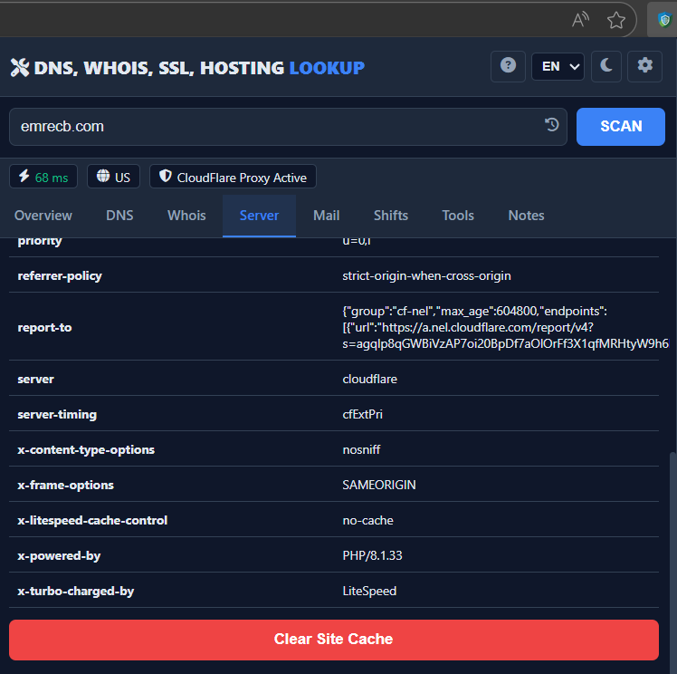

#### ⚡ Operational Efficiency (Smart Copy & Context Menu)
* **Click-to-Respond:** Every piece of data in the UI (IPs, SSL dates, DNS records) is interactive. Clicking a result automatically copies it to the clipboard as a professionally formatted customer support response template.
* **Quick Scan:** Integrated into the browser’s context menu, allowing users to right-click any selected domain name on a webpage to start an immediate analysis.

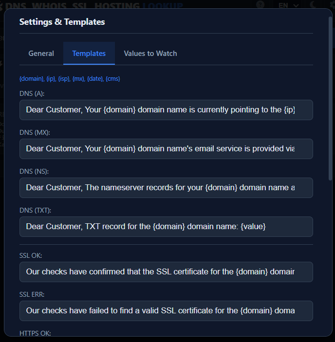

#### 🛠 Comprehensive Toolkit
* Detailed Whois query and registry analysis.
* Built-in shift tracking, break timers, and a “Notes” section for frequently used Linux/MySQL commands.

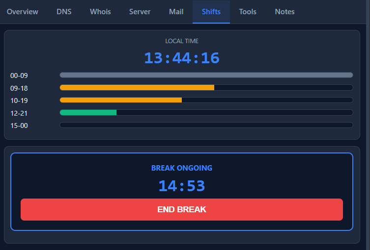
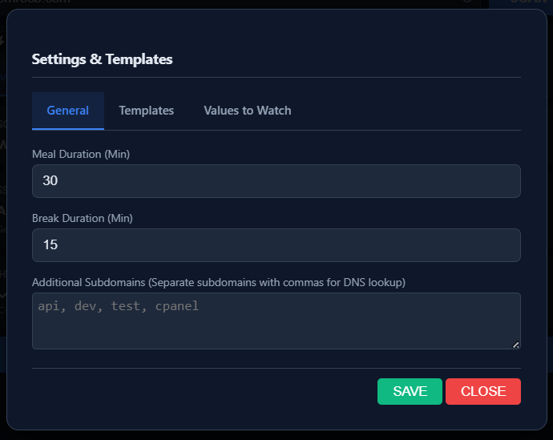
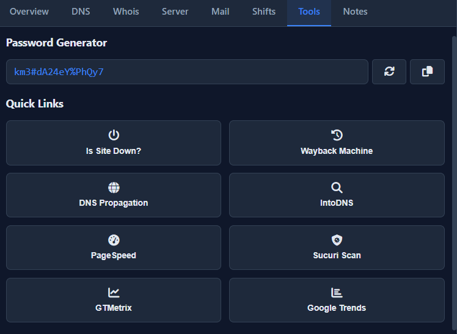

#### 🌍 Multi-Language & Extensible Core
* Full multi-language support (English/Turkish).
* Highly customizable settings managed via Local Storage.

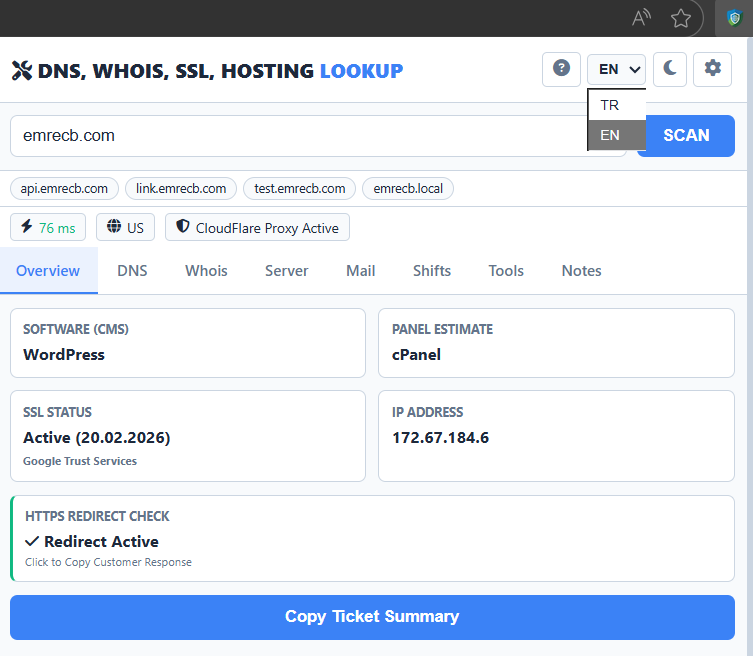

### 💻 Tech Stack
* JavaScript (ES6+)
* Chrome Extension API (Manifest V3)
* REST API Integrations (Google DNS, RDAP, IPWhois)
* Asynchronous Data Processing
